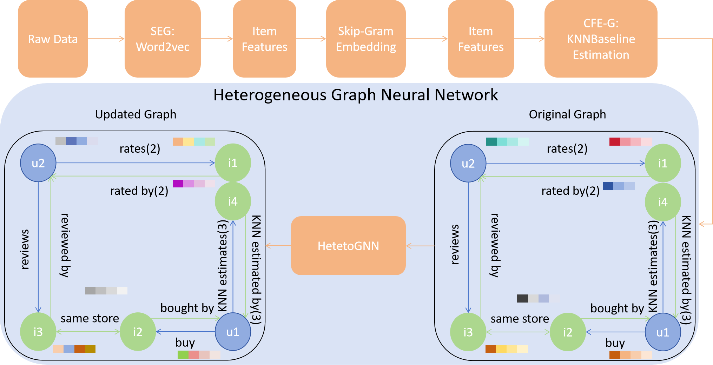
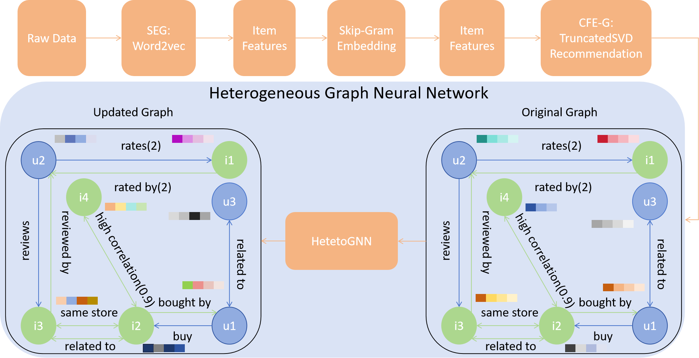

# Multi-Modal Semantic-Collaborative Graph Neural Networks: A Unified Framework for Interpretable Recommendation Under Extreme Data Sparsity

## W2VSHet-K mainstructure


## W2VSHet-T mainstructure


## Overview
In this paper, we propose a novel recommendation framework, W2VSHet-CF, that unifies collaborative-filtering knowledge with rich semantic signals from titles 
and user reviews inside a heterogeneous graph neural network (HeteroGNN). W2VSHet-CF forms enriched user/item representations by combining Word2Vec/Skip-Gram 
semantic embeddings with CF-derived structure—local KNN links and global TruncatedSVD factors—and then learns on a multi-typed heterogeneous graph via 
type-specific message passing to capture user–item, item–item, and user–user relations. Extensive experiments on four large-scale Amazon 2023 
review datasets—Fashion, Beauty, Musical Instruments, and Movies & TV—show that W2VSHet-CF consistently surpasses strong recent baselines on
RMSE and MAE, with two practical variants (W2VSHet-K for KNN edges and W2VSHet-T for SVD-based edges) delivering robust gains under extreme sparsity.


## Env Setting
```
git clone https://github.com/Kyro-Ma/W2VSHet-CF.git
cd W2VSHet-CF

conda create -n [env name] python=3.12 pip
conda activate [env name]

pip install -r requirements.txt

cd Preprocess
python json_to_pkl_transformation.py
```

## Datasets
We conduct our experiments on four subsets of the Amazon 2023 dataset. The Amazon 2023 dataset, curated by the McAuley Lab, is a large-scale collection of Amazon 
product reviews gathered in 2023. It contains rich information, including user-generated reviews, detailed item metadata, and relational links. For our study,
we focus on the Fashion, Beauty, Musical Instruments, and Movies and TV categories. The link to the datasets: https://amazon-reviews-2023.github.io. Should 
download metadata and reviews files and place them into ./Datasets directory.

## Quick Usage
### Train CF-SBERTHet/CF-SBERTHet-RW
```
cd Codes
python W2VSHet-K.py/W2VSHet-T.py
```


